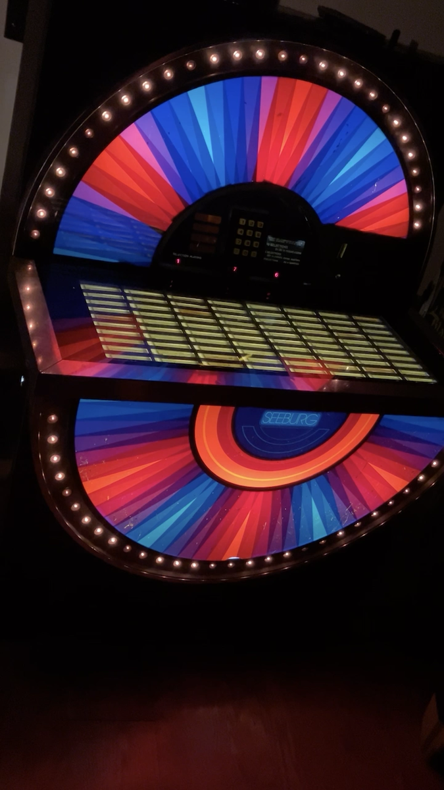
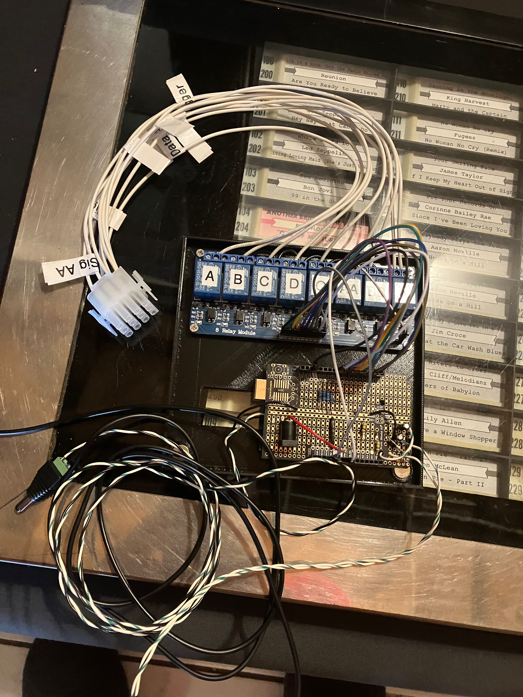

# Seeburg Autoplay

An Arduino-based autoplay controller for a Seeburg STD-3 jukebox (and likely other Seeburgs using the same selector scheme).

## What it is

I got this Seeburg STD-3 from a friend, moved it into my basement, and repaired it. Once it was working, I wanted it to play on its own — ambient jukebox mode — without anyone pushing buttons. This project is what I built to make that happen.

Rather than mod the jukebox itself, I wanted something fully reversible. So I pored over the schematics, figured out how the selector keypad encodes digit presses, and built a harness that intercepts the keypad wiring. An Arduino drives a relay shield that simulates the keypress combinations, entering a random selection every so often.

## How it works

The Seeburg selector keypad encodes each digit (0–9) as a combination of one "signal" line (Q, AA, or BB) and one or two "data" lines (A, B, C, D). To enter a three-digit selection, the jukebox expects three successive button presses.

The Arduino sketch:

- Picks a random selection (A-side 100–179 or B-side 200–279)
- Breaks it into three digits
- For each digit, energizes the correct sig + data relays and pulses a trigger line
- Tracks already-played selections so it doesn't immediately repeat songs
- Uses an audio signal detection circuit to decide when the current song has finished, and then queues the next one

See [`sketch_sep18a_copy_20241210162651.ino`](sketch_sep18a_copy_20241210162651.ino) for the full logic, including the digit → (sig, data) mapping in `buttonPress()`.

## Hardware

- Arduino (Uno-form-factor) with a proto shield for the audio detection circuit
- 8-channel relay shield for the sig/data/trigger lines
- A plug-in wiring harness with labeled connectors (SIG AA, SIG BB, SIG Q, data A–D, etc.) that taps into the keypad wiring — fully removable
- A 3D-printed magnetic mount that holds the Arduino + relay stack inside the jukebox cabinet, snapping onto the steel chassis without screws

## Status

In progress, but generally working. The main known issue is the song-end detection: the audio-signal circuit triggers on silence, which means quiet passages inside a song sometimes get mistaken for the song ending, and the controller queues up the next selection early. A better end-of-song signal (either a smarter audio detector, or tapping directly into a jukebox status line) is on the list. Please let me know if you have a suggestion here!

## Planned modes

Listed at the top of the sketch and partially wired up on the pins - I still need to mount the mode switch.

- **On/Off** — toggle power to the Arduino
- **Allow repeats** — toggle whether played selections can come back around
- **A / B / Both** — restrict random picks to one side or both
- **Pause** — delay between songs, via potentiometer or a few presets (0–5 minutes)
